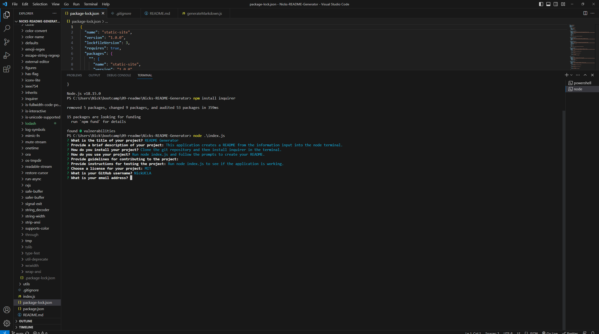

# Readme Generator Project using Node.js

## Description

This project is a simple command-line tool built with Node.js that generates a README file for your project based on user input. The generated README file includes sections for project description, installation instructions, usage guidelines, contribution guidelines, testing instructions, licensing information, and contact details.
[](https://github.com/NickUCLA/Nicks-README-Generator)
[Demonstration Video](https://drive.google.com/file/d/1fdg4oqVZux7i6IyrY0fdQP_hfdGOfUSO/view?usp=sharing)

## Table of Contents

- [Installation](#installation)
- [Usage](#usage)
- [Contributing](#contributing)
- [License](#license)
- [Questions](#questions)

## Installation

To install the required dependencies, run the following command:

```bash
npm install
```

This project uses the following dependencies:

inquirer: A package that provides an easy way to gather user input in the command line.

## Usage

Run the generator using the following command:

```bash
node index.js
```

You will be prompted with a series of questions about your project. Answer these questions to provide the necessary information for the README file.

Once you've answered all the questions, a README file named README.md will be generated in the project directory.

## Contributing

If you'd like to contribute to this project, please follow these steps:

Fork the repository.
Create a new branch for your feature or bug fix.
Make your changes and commit them.
Push your changes to your fork.
Submit a pull request to this repository.
Testing
If you want to test the generator's functionality, you can run it with:

```bash
node index.js
```

Answer the questions with sample data to see how the generated README file looks.

## License

This project is licensed under the MIT License.


## Questions

If you have any questions or concerns, feel free to contact me:

GitHub: [GitHub Profile](https://github.com/NickUCLA)
Email: nheal179@gmail.com
